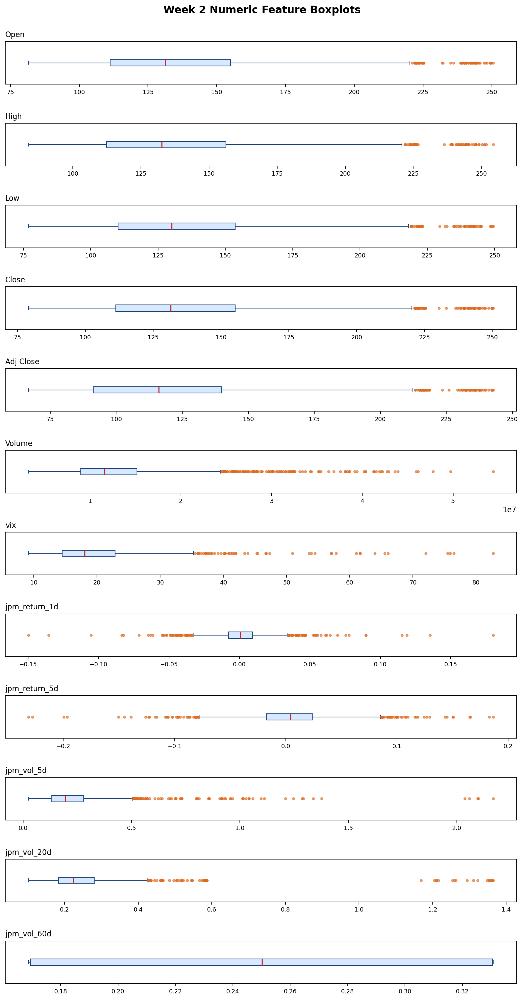

# Week 2 Data Quality Report

- Observations analyzed before cleaning: 1827
- Observations after cleaning: 1303
- Numeric features checked: 32
- Features with missing values before cleaning: 32

## Missing-Value Strategy
- Price fields (`Open`, `High`, `Low`, `Close`, `Adj Close`, `Volume`) use interpolation across the daily calendar because the raw files contain short calendar gaps and market non-trading days.
- Macro series (`dgs10`, `vix`) use forward fill so the most recent observed level is carried forward without using future information.
- Dividend features are forward-filled after quarterly aggregation because dividend values remain valid until the next announcement.
- News counts and sentiment scores use neutral defaults when a day has no news, because zero activity and neutral sentiment are the least misleading assumptions.
- Rolling features keep their warm-up rows missing until enough history exists, and any remaining incomplete rows are dropped before export.
- Residual gaps are treated as incomplete observations and removed rather than guessed.

## Outlier Strategy
- Outliers are identified with the 3σ rule using mean ± 3 standard deviations.
- Flagged values are replaced with the column median computed from inlier observations.
- The boxplot figure is kept as a visualization aid so you can inspect the distribution of each numeric feature, but it is not the rule used for outlier detection.
- News-derived features are excluded from the boxplot figure so the plot focuses on financial series with comparable numeric scales.

## Visualizations

### Numeric Feature Boxplots
Description: Boxplots summarize the distribution of the core market features before cleaning so you can inspect scale, skew, and extreme values. This figure covers 12 plotted features: price, volume, VIX, returns, and volatility.

## Range Validation
- VIX is expected to stay above 0.
- JPM return features are checked against a -10% to 10% sanity band.
- Total range violations found: 46

## Detailed Statistics
- The full machine-readable table remains in the CSV export if you need the per-feature metrics, bounds, and fill strategy columns.
- See `week2_data_quality_report_v1.0_20260521.md` for the editable source report.
- See `week2_data_quality_report_v1.0_20260521.pdf` for the PDF export rendered from the Markdown source.