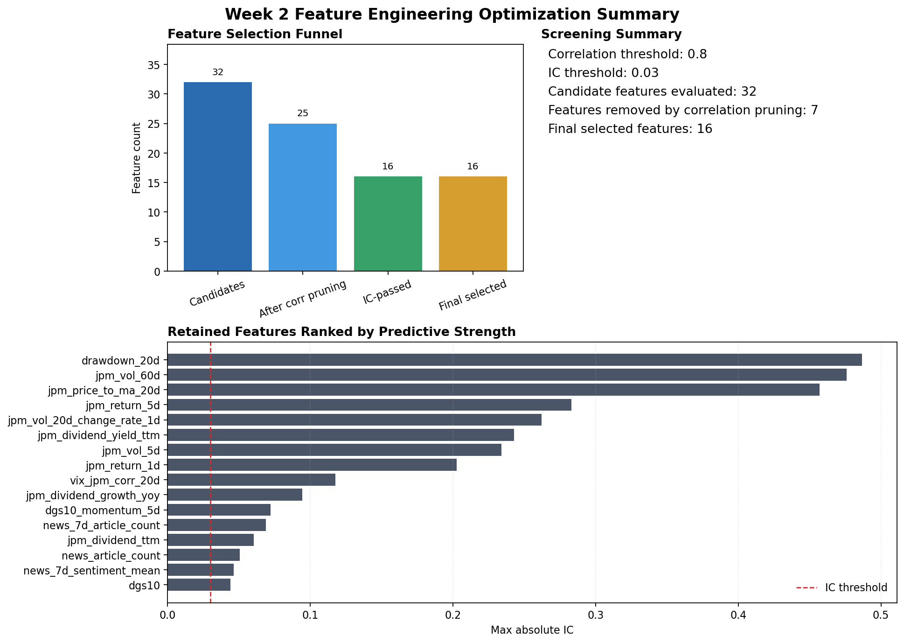
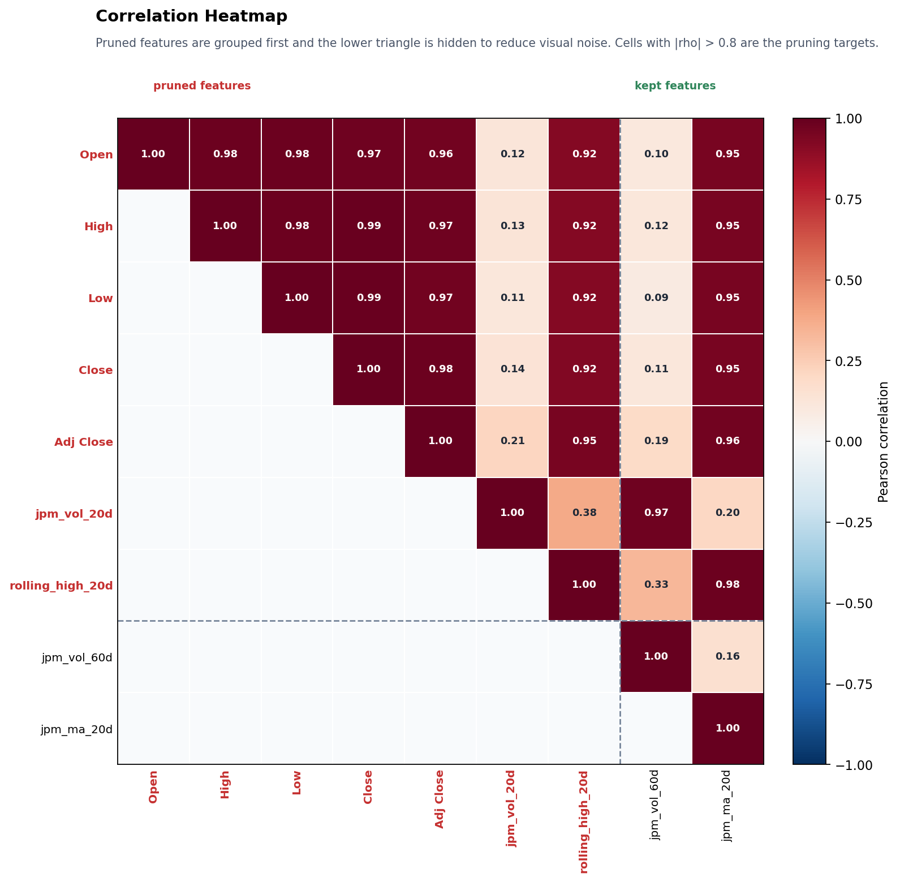
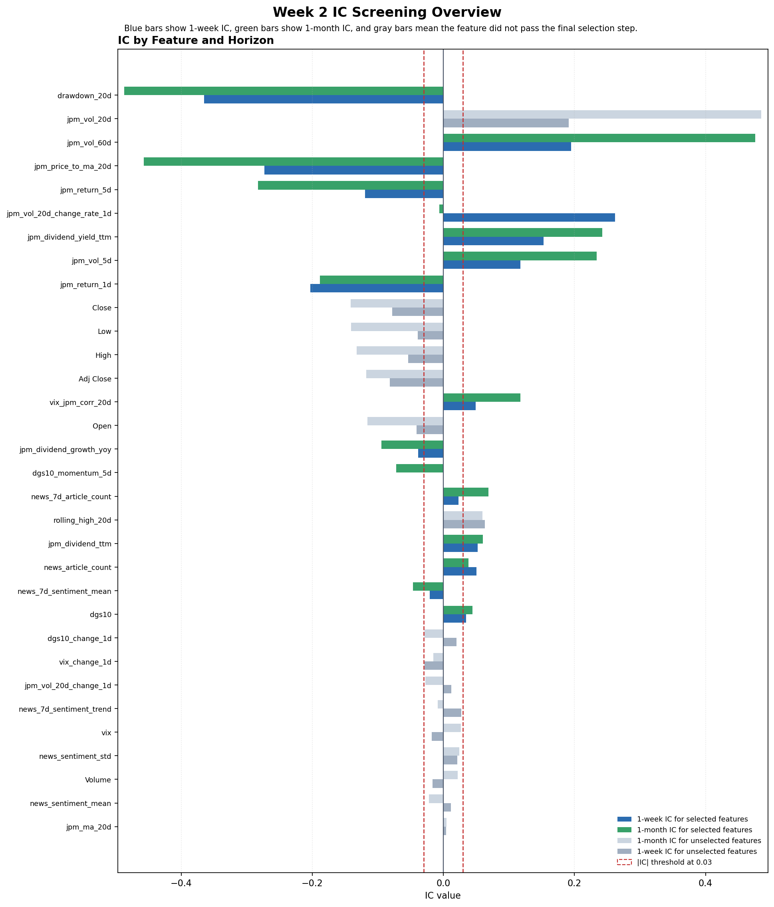

# Week 2 Feature Engineering Optimization Report

This stage evaluated 32 candidate features and finally kept 16 features for the modeling dataset.
Before IC screening, 7 features were removed because they were too similar to other candidates, using a Pearson correlation threshold of 0.8.
The IC filter then kept only features with absolute IC above 0.03 on at least one horizon, where the horizons are 5 trading days for the 1-week target and 21 trading days for the 1-month target.

## Visualizations

### Correlation Heatmap
This heatmap groups the features removed by correlation pruning at the front, hides the redundant lower triangle, and keeps the figure focused on the variables excluded for exceeding the 0.8 threshold. Cells with absolute correlation above 0.8 are the main pruning targets.

### IC Bar Chart
This chart compares each feature's IC at the 1-week and 1-month horizons. Blue bars show the 1-week IC, green bars show the 1-month IC, and gray bars indicate features that did not pass the final selection step. The dashed lines mark the +/- 0.03 threshold used for selection.

## What Changed
The feature set was redesigned to make the inputs more informative and less redundant. Trailing dividend features were transformed into dividend yield so they are comparable across time. Volatility was expanded to 5-day, 20-day, and 60-day windows, and the 20-day volatility series also gained level-change and rate-change signals. These changes make the feature set more expressive without turning it into a long list of nearly duplicated variables.

The correlation screen removed features that were overlapping too heavily with others, so the remaining set is easier to interpret and less likely to double-count the same information. The correlation matrix shows that some candidate features are highly redundant, so correlation pruning runs before IC screening.

After the IC check, the surviving features were the ones that showed a meaningful relationship with future returns. The strongest retained names were drawdown_20d, jpm_vol_60d, jpm_price_to_ma_20d, jpm_return_5d, jpm_vol_20d_change_rate_1d.

## Interpretation
Overall, this report shows that the pipeline moved from a broad raw candidate pool to a compact set of features centered on price momentum, volatility behavior, rate dynamics, VIX interaction, dividend yield, and news activity. In other words, the final feature set is meant to be explained in sentences rather than read as a spreadsheet dump.

## Final Note
The selected feature set is not exhaustive of every raw input; it is the compact subset that passed both the correlation and IC filters, and it is intended for downstream modeling rather than manual inspection of raw columns.