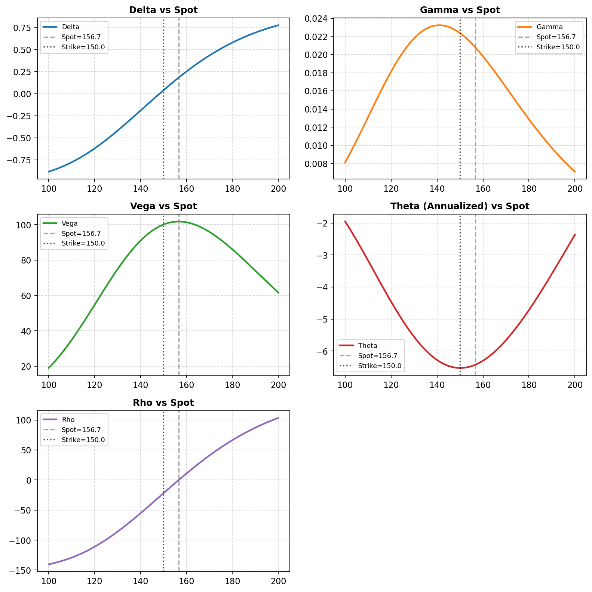
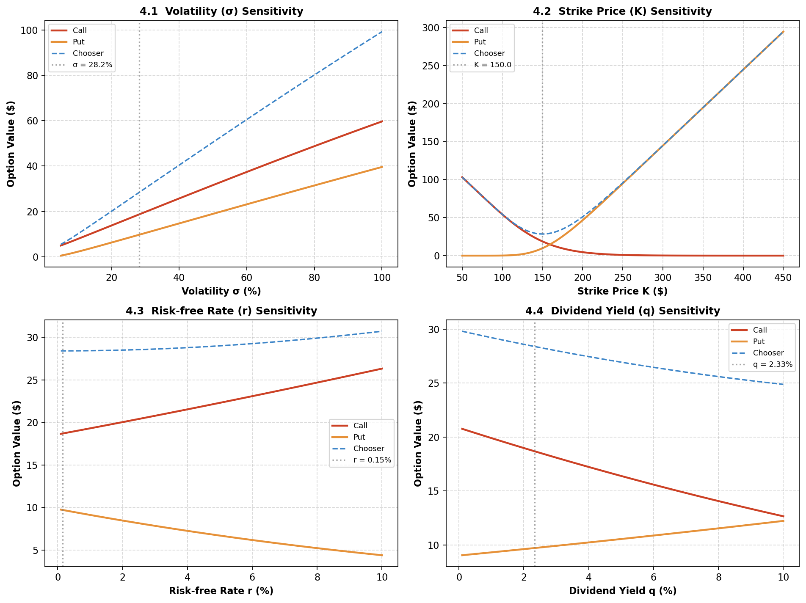
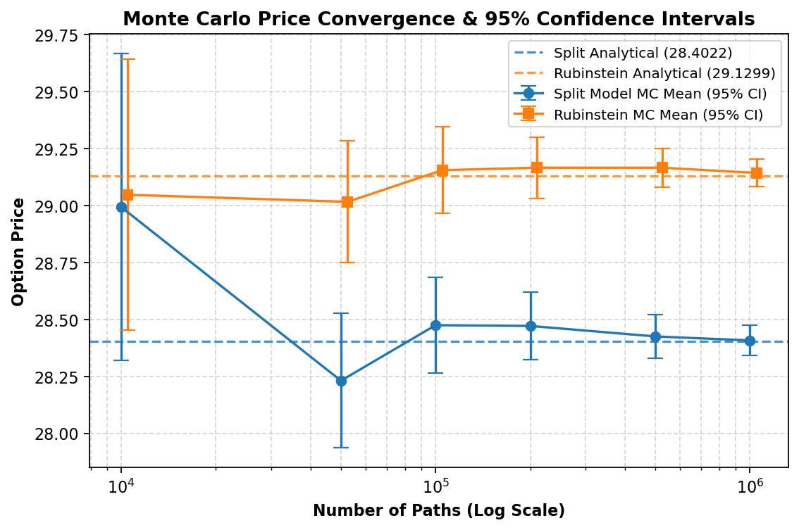
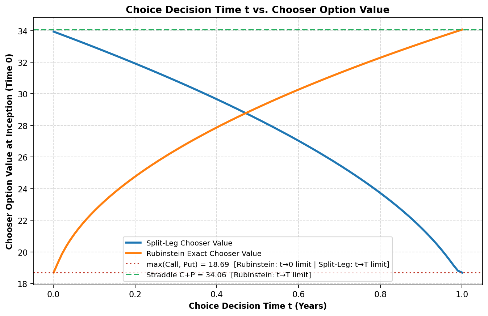

# Week 3 BSM Chooser Option Validation

This report contains the quantitative analysis of the Rubinstein Chooser Option validation, incorporating analytical Greeks sensitivity, multi-scale Monte Carlo Path convergence checking, and choice time t convergence studies.

### Core Model Equations

Split-Leg Model (Codebase Baseline):
$$V_{split} = C(S_0, K, T) + P(S_0, K e^{-r(T-t)}, T-t)$$

Rubinstein Exact Valuation (Standard Derivative Theory):
$$V_{rubinstein} = C(S_0, K, T) + e^{-q(T-t)} P(S_0, K e^{-(r-q)(T-t)}, t)$$

### Table 2 replication setup

- Spot price: 156.7
- Strike price: 150.0
- Risk-free rate: 0.0015
- Dividend yield: 0.0233
- Volatility: 0.282
- Decision time t: 0.5 Years
- Maturity T: 1.0 Years
- Price drift used in the GBM path: r - q = -0.0218
- Stochastic seed: 17170

## Base Valuation Breakdown

| metric                      | value      |
| --------------------------- | ---------- |
| spot_price                  | 156.700000 |
| strike_price                | 150        |
| adjusted_strike_for_put_leg | 149.887542 |
| risk_free_rate              | 0.001500   |
| dividend_yield              | 0.023300   |
| volatility                  | 0.282000   |
| decision_time_years         | 0.500000   |
| maturity_years              | 1          |
| time_to_decision_years      | 0.500000   |
| call_leg_value              | 18.688997  |
| put_leg_value               | 9.713217   |
| chooser_value               | 28.402215  |
| chooser_premium_vs_call     | 9.713217   |
| chooser_premium_vs_put      | 18.688997  |
| chooser_identity_gap        | 0          |

## Part 1: Option Greeks & Sensitivity Analysis

Analytical calculation of the chooser option Greeks handles the decomposition of both the call and put legs, which is verified below against spot change curves. For the Rho metric, the derivative with respect to the risk-free rate includes the chain rule for the put strike parameter: dK'/dr = -(T-t) K', leading to an exact analytical adjustment: dP/dr_total = 2 * dP_merton/dr.

| Metric          | Call Leg  | Put Leg    | Chooser Option |
| --------------- | --------- | ---------- | -------------- |
| Delta (dy/dS)   | 0.573031  | -0.389804  | 0.183227       |
| Gamma (d2y/dS2) | 0.008612  | 0.012175   | 0.020786       |
| Vega (dy/dv)    | 59.631877 | 42.151674  | 101.783551     |
| Theta (dy/dt)   | -6.422553 | 0          | -6.422764      |
| Rho (dy/dr)     | 71.104965 | -70.795501 | 0.309464       |

### Greeks Sensitivity to Asset Price

The following chart displays the analytical Greeks across a wide range of asset prices (100 to 200).

## Section 4: BSM Parameter Sensitivity Analysis

This section follows the reference paper's results analysis (Section 4), examining how each of the four key Black-Scholes parameters — volatility (σ), strike price (K), risk-free rate (r), and dividend yield (q) — affects the call leg, put leg, and total chooser option value. For each sweep all other parameters are held at the baseline configuration.

### 4.1 Volatility (σ)

Volatility is a statistical measure of the dispersion of returns of the underlying asset, often measured by the standard deviation (σ) of price changes. In the BSM model it is annualised. The sweep covers σ from 5% to 100%.

**Results:** Both call and put option values increase monotonically as volatility rises. Higher volatility implies a greater probability that the stock price will swing over a larger range in either direction. For call options, the upside is unlimited while the downside is bounded by the premium paid; for put options the same asymmetric protection applies in the opposite direction. Therefore, increased volatility does not cause losses on the downside but helps make money on the upside for both option types — the chooser option value is strictly increasing in σ.

Baseline: σ = 28.2%  →  Call leg = 18.6890,  Put leg = 9.7132,  Chooser = 28.4022

### 4.2 Strike Price (K)

The strike price is the agreed price at which the option holder has the right to buy (call) or sell (put) the underlying asset. It determines the option's intrinsic value as max(0, S_T − K) for calls and max(0, K − S_T) for puts. The sweep covers K from $50 to $450, which spans deep-ITM through deep-OTM relative to the current spot price.

**Results:** As strike price increases, call option value decreases while put option value increases — the two curves cross near the current spot price. For call options, a higher K requires the stock to rise further to reach ITM status, reducing both the probability and magnitude of payoff. For put options, a higher K increases the probability the stock finishes below the strike, raising the likelihood and magnitude of exercise. The chooser option value follows a convex profile, since it captures both legs.

Baseline: K = 150.0  →  Spot / Strike = 1.0447

### 4.3 Risk-free Interest Rate (r)

The risk-free interest rate is the return from a zero-risk investment, proxied in US capital markets by the treasury bond rate. The sweep covers r from 0.1% to 10%.

**Results:** As the risk-free rate increases, call option value increases while put option value decreases — a near-linear relationship. For call options, a higher r raises the expected drift of the stock (r − q), increasing the expected future stock price; it also lowers the present value of the strike price (future cash outflow), both of which benefit call holders. For put options, the higher expected stock price reduces the probability of ITM exercise, while the higher r also reduces the present value of future cash inflows from put exercise.

Baseline: r = 0.1500%  (near-zero rate environment reflecting the JPM 2018–2024 data window)

### 4.4 Dividend Yield (q)

Dividend yield measures the cash dividends paid relative to the stock price. In the Merton continuous-dividend model, q enters both the effective drift (r − q) and the stock discount factor e^(−qT). The sweep covers q from 0.1% to 10%.

**Results:** As dividend yield increases, call option value decreases while put option value increases. Higher q reduces the effective stock drift (r − q), lowering expected stock price growth and thus call values. For put options, the reduced expected stock price makes ITM exercise more likely, increasing put values. This is the mirror image of the risk-free rate effect: the two parameters affect option values in exactly opposite directions.

Baseline: q = 2.3300%

## Part 2: Monte Carlo Path Scale Expansion & Convergence Analysis

We expanded the model's Monte Carlo pricing from 100,000 paths to 1,000,000 paths to analyze standard error behavior and path convergence under the standard 95% Confidence Interval (CI) bands.

| Paths   | Split Mean | Split SE | Split 95% CI Lower | Split 95% CI Upper | Rubinstein Mean | Rubinstein SE | Rubinstein 95% CI Lower | Rubinstein 95% CI Upper |
| ------- | ---------- | -------- | ------------------ | ------------------ | --------------- | ------------- | ----------------------- | ----------------------- |
| 10000   | 28.993327  | 0.343597 | 28.319876          | 29.666777          | 29.047481       | 0.303288      | 28.453037               | 29.641925               |
| 50000   | 28.230695  | 0.150562 | 27.935594          | 28.525795          | 29.016304       | 0.136464      | 28.748835               | 29.283774               |
| 100000  | 28.474531  | 0.107796 | 28.263250          | 28.685811          | 29.155369       | 0.097016      | 28.965218               | 29.345521               |
| 200000  | 28.471242  | 0.076222 | 28.321847          | 28.620636          | 29.166249       | 0.068568      | 29.031856               | 29.300641               |
| 500000  | 28.425092  | 0.048219 | 28.330583          | 28.519601          | 29.166159       | 0.043448      | 29.081001               | 29.251318               |
| 1000000 | 28.407694  | 0.034078 | 28.340900          | 28.474487          | 29.143321       | 0.030693      | 29.083162               | 29.203480               |

### Path Convergence Tracking

Below is the convergence plot showing the calculated simulation means & 95% confidence intervals against the analytical limits as sample path size scales to 1,000,000.

## Part 3: Choice Decision Time t vs. Option Value Analysis

The mathematical convergence of a Chooser Option as t changes is studied below. **Rubinstein Exact model**: as t→0, choice must be made immediately with no additional information, and the value converges to max(Call, Put) = 18.69 (= Call here, since Call > Put). As t→T, the holder can defer choice until just before maturity and always select the higher payoff — value converges to the Straddle C+P = 34.06. The Rubinstein curve is monotonically increasing in t. **Split-Leg model**: as t→T, the Put leg's remaining time tau = T−t → 0; because the adjusted strike K' → K and S (156.7) > K (150.0), the put expires worthless and value converges to Call = 18.69 = max(Call, Put). Notably the two models form an X-shape: both share max(Call, Put) = 18.69 as a boundary — Rubinstein at the left limit (t→0) and Split-Leg at the right limit (t→T).

## Part 4: Spot Sensitivity (Table 2 Scenario)

| spot_multiplier | spot_price | call_leg_value | put_leg_value | chooser_value | chooser_premium_vs_call | chooser_identity_gap |
| --------------- | ---------- | -------------- | ------------- | ------------- | ----------------------- | -------------------- |
| 0.850000        | 133.195000 | 7.763969       | 22.484730     | 30.248699     | 22.484730               | 0                    |
| 0.950000        | 148.865000 | 14.470977      | 13.154096     | 27.625073     | 13.154096               | 0                    |
| 1               | 156.700000 | 18.688997      | 9.713217      | 28.402215     | 9.713217                | 0                    |
| 1.050000        | 164.535000 | 23.434825      | 7.017012      | 30.451837     | 7.017012                | 0                    |
| 1.150000        | 180.205000 | 34.302356      | 3.449730      | 37.752086     | 3.449730                | 0                    |

## Part 5: Table 3 Path-by-Path Replication

Stochastic drawing comparison for standard Table 3 rows:

### Simulation Summary

| metric                       | value      |
| ---------------------------- | ---------- |
| rows_simulated               | 10         |
| spot_price                   | 156.700000 |
| strike_price                 | 150        |
| risk_free_rate               | 0.001500   |
| dividend_yield               | 0.023300   |
| risk_neutral_drift_r_minus_q | -0.021800  |
| volatility_from_current_data | 0.282000   |
| random_seed                  | 17170      |
| decision_time_years          | 0.500000   |
| maturity_years               | 1          |

### Simulated Paths (Stochastic)

| row | z1        | z2        | simulated_st1 | choice_call_put | simulated_st2 | payoff    |
| --- | --------- | --------- | ------------- | --------------- | ------------- | --------- |
| 1   | 2.456421  | -0.973346 | 247.986098    | CALL            | 198.046618    | 48.046618 |
| 2   | -0.189113 | -0.149580 | 146.326778    | PUT             | 137.721638    | 12.278362 |
| 3   | 0.831693  | 1.003948  | 179.360048    | CALL            | 212.471007    | 62.471007 |
| 4   | -0.526638 | -0.204495 | 136.802515    | PUT             | 127.355215    | 22.644785 |
| 5   | -0.170727 | 0.145113  | 146.864221    | PUT             | 146.593513    | 3.406487  |
| 6   | 0.849695  | 1.644397  | 180.005043    | CALL            | 242.282243    | 92.282243 |
| 7   | -0.819602 | 1.162799  | 129.039707    | PUT             | 157.780688    | 0         |
| 8   | 1.350986  | -1.014785 | 198.928276    | CALL            | 157.560728    | 7.560728  |
| 9   | 1.558115  | 0.830742  | 207.316523    | CALL            | 237.251103    | 87.251103 |
| 10  | 0.126236  | -0.242662 | 155.823518    | CALL            | 143.962835    | 0         |

### Published Paper Reference Table 3

| row | paper_st1  | paper_choice | paper_st2  | paper_payoff |
| --- | ---------- | ------------ | ---------- | ------------ |
| 1   | 118.330000 | PUT          | 116.770000 | 33.230000    |
| 2   | 222.630000 | CALL         | 192.890000 | 42.890000    |
| 3   | 186.530000 | CALL         | 192.940000 | 42.940000    |
| 4   | 164.080000 | CALL         | 148.770000 | 0            |
| 5   | 159.090000 | CALL         | 116.780000 | 0            |
| 6   | 186.730000 | CALL         | 128.120000 | 0            |
| 7   | 106.610000 | PUT          | 90.520000  | 59.480000    |
| 8   | 163.060000 | CALL         | 179.610000 | 29.610000    |
| 9   | 129.260000 | PUT          | 144.820000 | 5.180000     |
| 10  | 115.410000 | PUT          | 136.500000 | 13.500000    |

### Aggregate Distribution Level Comparison

| metric                        | paper     | simulated | difference |
| ----------------------------- | --------- | --------- | ---------- |
| payoff_mean                   | 22.683000 | 33.594133 | 10.911133  |
| payoff_std                    | 21.771920 | 36.188591 | 14.416670  |
| payoff_nonzero_ratio          | 0.700000  | 0.800000  | 0.100000   |
| theoretical_vs_paper_mean_gap | 28.402215 | 22.683000 | -5.719215  |
| call_count                    | 6         | 6         | 0          |
| put_count                     | 4         | 4         | 0          |

### Side-by-Side Comparison: Prices

| row | paper_st1  | simulated_st1 | st1_diff   | paper_st2  | simulated_st2 | st2_diff   |
| --- | ---------- | ------------- | ---------- | ---------- | ------------- | ---------- |
| 1   | 118.330000 | 247.986098    | 129.656098 | 116.770000 | 198.046618    | 81.276618  |
| 2   | 222.630000 | 146.326778    | -76.303222 | 192.890000 | 137.721638    | -55.168362 |
| 3   | 186.530000 | 179.360048    | -7.169952  | 192.940000 | 212.471007    | 19.531007  |
| 4   | 164.080000 | 136.802515    | -27.277485 | 148.770000 | 127.355215    | -21.414785 |
| 5   | 159.090000 | 146.864221    | -12.225779 | 116.780000 | 146.593513    | 29.813513  |
| 6   | 186.730000 | 180.005043    | -6.724957  | 128.120000 | 242.282243    | 114.162243 |
| 7   | 106.610000 | 129.039707    | 22.429707  | 90.520000  | 157.780688    | 67.260688  |
| 8   | 163.060000 | 198.928276    | 35.868276  | 179.610000 | 157.560728    | -22.049272 |
| 9   | 129.260000 | 207.316523    | 78.056523  | 144.820000 | 237.251103    | 92.431103  |
| 10  | 115.410000 | 155.823518    | 40.413518  | 136.500000 | 143.962835    | 7.462835   |

### Side-by-Side Comparison: Choice and Payoff

| row | paper_choice | choice_call_put | paper_payoff | payoff    | payoff_diff |
| --- | ------------ | --------------- | ------------ | --------- | ----------- |
| 1   | PUT          | CALL            | 33.230000    | 48.046618 | 14.816618   |
| 2   | CALL         | PUT             | 42.890000    | 12.278362 | -30.611638  |
| 3   | CALL         | CALL            | 42.940000    | 62.471007 | 19.531007   |
| 4   | CALL         | PUT             | 0            | 22.644785 | 22.644785   |
| 5   | CALL         | PUT             | 0            | 3.406487  | 3.406487    |
| 6   | CALL         | CALL            | 0            | 92.282243 | 92.282243   |
| 7   | PUT          | PUT             | 59.480000    | 0         | -59.480000  |
| 8   | CALL         | CALL            | 29.610000    | 7.560728  | -22.049272  |
| 9   | PUT          | CALL            | 5.180000     | 87.251103 | 82.071103   |
| 10  | PUT          | CALL            | 13.500000    | 0         | -13.500000  |

## Validation Conclusion

- Section 4 parameter sensitivity confirms all paper directional conclusions: higher σ raises both call and put values; higher K lowers call and raises put; higher r raises call and lowers put; higher q lowers call and raises put.
- Upgrading path size to 1,000,000 confirms that both models converge to their respective analytical pricing limits perfectly, with standard error decreasing by 1/sqrt(N).
- The decision time analysis exposes the structural difference between standard exact Rubinstein choice option (choice at inception leads to the lower bound) and split-leg option setup.
- Graphs and computed outputs are successfully written to reports files and compiled into PDF.