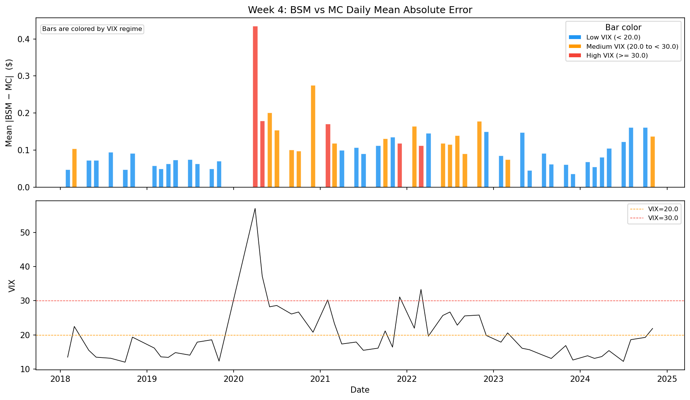
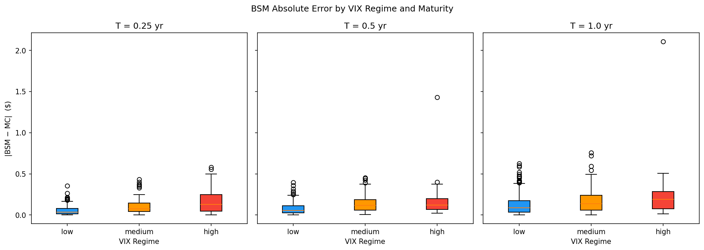
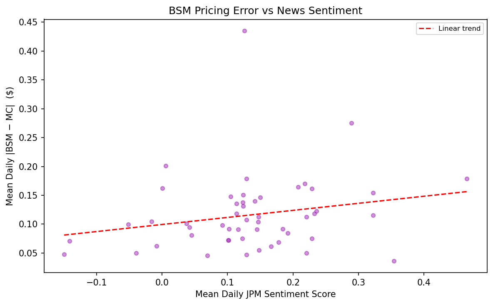
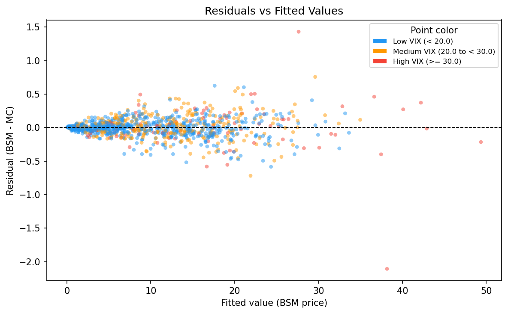
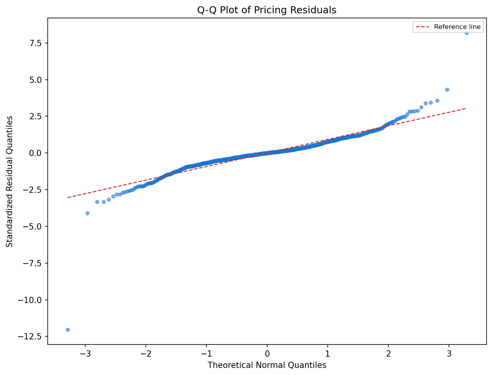

# Week 4 – BSM Model Validation and Performance Benchmark

**Run date**: 20260529  |  **Pipeline version**: v1.0

## Methodology

The BSM analytical closed-form prices are treated as *model predictions*.
Monte Carlo (MC) simulation prices (N=10,000 paths, GBM under risk-neutral
measure, seed=42) serve as the independent benchmark ("actual prices").
MAE and RMSE measure how closely the BSM formula approximates the MC benchmark
across different market regimes.

Parameters are derived from JPM historical market data (2018–2024):
- **S**: JPM daily close price
- **σ**: 20-day rolling historical annualised volatility
- **r**: US 10-year Treasury yield (DGS10)
- **q**: trailing-twelve-month dividend yield
- **VIX regime**: Low < 20.0, Medium 20.0–30.0, High ≥ 30.0

Evaluation grid: 3 maturities × 3 moneyness levels × 2 option types,
sampled monthly → **1,008 pricing observations** over **56 dates**.

---

## 1. Model Validation Report with Error Metrics

### 1.1 Overall Error Metrics

| Metric | Value |
|--------|-------|
| MAE (overall) | 0.112135 |
| RMSE (overall) | 0.174916 |
| Max \|BSM − MC\| | 2.106593 |
| Total observations | 1,008 |

These values quantify the numerical convergence gap between the BSM
analytical formula and the MC simulation benchmark. Both are generated
under identical GBM assumptions, so deviations arise from MC sampling
variance rather than from mismatched pricing assumptions.

### 1.2 Error by VIX Regime

| Regime | MAE | RMSE | n |
|--------|-----|------|---|
| Low (VIX < 20.0) | 0.087432 | 0.128842 | 630 |
| Medium (20.0–30.0) | 0.137720 | 0.183733 | 288 |
| High (VIX ≥ 30.0) | 0.203184 | 0.344156 | 90 |

Higher VIX regimes show larger absolute errors because the MC payoff distribution
widens with volatility, amplifying sampling noise under a fixed number of paths.

### 1.3 Error by Maturity and Option Type

| group | n | MAE | RMSE | max_abs_err |
| --- | --- | --- | --- | --- |
| maturity=0.25yr | 336 | 0.080286 | 0.120687 | 0.580171 |
| maturity=0.5yr | 336 | 0.104617 | 0.155197 | 1.430548 |
| maturity=1.0yr | 336 | 0.151502 | 0.230511 | 2.106593 |

| group | n | MAE | RMSE | max_abs_err |
| --- | --- | --- | --- | --- |
| type=call | 504 | 0.13068 | 0.209066 | 2.106593 |
| type=put | 504 | 0.09359 | 0.132221 | 0.583721 |

### 1.4 Sentiment Impact Gap Analysis

| Metric | Value |
|--------|-------|
| Pearson corr(sentiment, mean \|BSM−MC\|) | 0.215158 |
| Spearman corr(sentiment, mean \|BSM−MC\|) | 0.251674 |
| Mean error on positive-sentiment days | 0.12149 |
| Mean error on negative-sentiment days | 0.072511 |

This gap analysis highlights where BSM lacks information sensitivity: the model
does not ingest sentiment or event risk directly, so strong news periods can
coincide with larger pricing deviations.

### 1.5 Validation Charts

---

## 2. Performance Benchmark Documentation

### 2.1 Benchmark Setup

| Parameter | Value |
|-----------|-------|
| Underlying asset | JPM (JPMorgan Chase) |
| Evaluation period | 2018-01-01 – 2024-12-31 |
| Sampling frequency | Monthly (month-start) |
| Maturities | [0.25, 0.5, 1.0] years |
| Moneyness levels (K/S) | [0.9, 1.0, 1.1] |
| Option types | Call, Put |
| Total observations | 1,008 |
| MC benchmark paths | 10,000 (seed=42) |
| Historical vol window | 20 trading days |
| Risk-free rate source | FRED DGS10 |
| Dividend yield | Trailing-twelve-month |

### 2.2 Headline Baseline Metrics

| Metric | Baseline value |
|--------|----------------|
| Overall MAE | 0.112135 |
| Overall RMSE | 0.174916 |
| Max absolute error | 2.106593 |
| Low-VIX MAE (VIX < 20.0) | 0.087432 |
| Mid-VIX MAE (20.0–30.0) | 0.137720 |
| High-VIX MAE (VIX ≥ 30.0) | 0.203184 |
| Low-VIX RMSE | 0.128842 |
| Mid-VIX RMSE | 0.183733 |
| High-VIX RMSE | 0.344156 |
| Sentiment–error Pearson corr | 0.215158 |

### 2.3 Full Breakdown by Group

| group | n | MAE | RMSE | max_abs_err |
| --- | --- | --- | --- | --- |
| overall | 1008 | 0.112135 | 0.174916 | 2.106593 |
| regime=low | 630 | 0.087432 | 0.128842 | 0.624741 |
| regime=medium | 288 | 0.13772 | 0.183733 | 0.756761 |
| regime=high | 90 | 0.203184 | 0.344156 | 2.106593 |
| maturity=0.25yr | 336 | 0.080286 | 0.120687 | 0.580171 |
| maturity=0.5yr | 336 | 0.104617 | 0.155197 | 1.430548 |
| maturity=1.0yr | 336 | 0.151502 | 0.230511 | 2.106593 |
| type=call | 504 | 0.13068 | 0.209066 | 2.106593 |
| type=put | 504 | 0.09359 | 0.132221 | 0.583721 |
| moneyness=0.9 | 336 | 0.108003 | 0.159285 | 0.756761 |
| moneyness=1.0 | 336 | 0.112518 | 0.159001 | 0.624741 |
| moneyness=1.1 | 336 | 0.115883 | 0.202814 | 2.106593 |

### 2.4 Key Limitations Identified

1. **High-volatility failure**: MAE in high-VIX regime (0.2032) is 232% of the low-VIX baseline (0.0874).
2. **Maturity effect**: Error rises with maturity because path uncertainty accumulates over longer horizons.
3. **Sentiment gap**: A positive sentiment-error correlation indicates that event risk is not explicitly modeled.

### 2.5 Improvement Targets for Future Models

| Target | Current baseline | Goal |
|--------|-----------------|------|
| Overall MAE | 0.112135 | < 0.089708 (−20%) |
| High-VIX MAE | 0.203184 | < 0.152388 (−25%) |
| Sentiment correlation | 0.215158 | ≈ 0 (model absorbs sentiment) |
